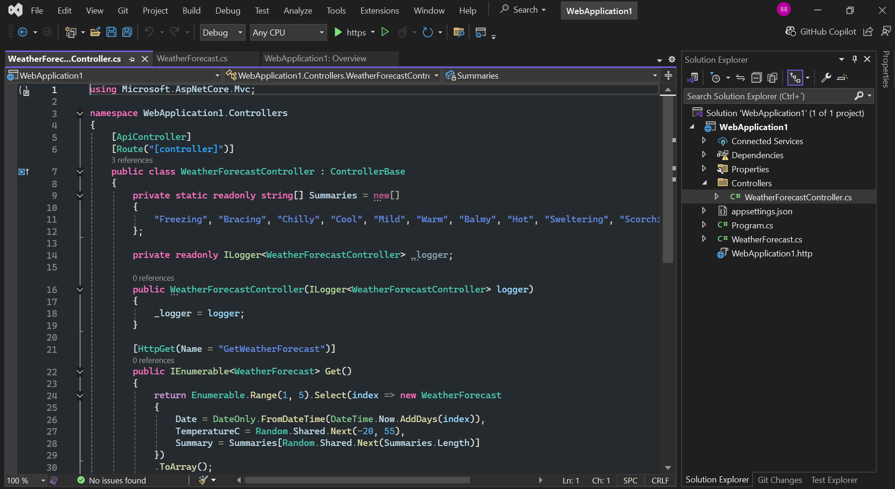

# Nord Theme for [Visual Studio 2022](http://visualstudio.com)

The Nord Theme is designed to reduce eye strain with a soft, calming color palette. Gentle contrasts and muted hues provide a comfortable coding experience, allowing you to focus for longer periods without discomfort. Ideal for reducing fatigue during long coding sessions.

## Preview 

## License

[MIT License](./LICENSE)

## How to add it to Visual Studio

Clone the repository:

    git clone https://github.com/brenobaronte/nord-theme

0. Open your Visual Studio
1. Tools
2. Import and Export Settings...
3. Import selected environment settings
4. Yes, save my current settings - it is good because keep a copy of what you already have
5. Browse... (Find and select the NordTheme.vssettings file you downloaded)
6. Next > Finish > Close.